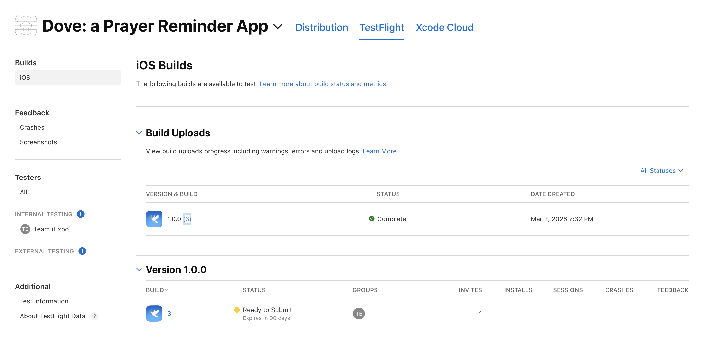

# Dove: a Prayer Reminder App

An iOS app built and deployed by Hojune Kim - from product design to App Store submission with in-app subscriptions

---

## Overview

Dove is a daily prayer reminder application for iOS users. It contains an onboarding flow for collecting personalised information, a Bible quote reveal interaction, and a user-defined alarm reminder for prayers on chosen weekdays and time. The app provides monthly and yearly subscription with a 3-day free trial.

---

## Features

**Personalised onboardings**

- collects name, faith practice, interested topics, and personal goals for personalised experience of the app

**Bible quote reveal**

- handles tap-to-reveal interactions on the main prayer screen

**In-app subscription**

- provides monthly and yearly subscription with a 3-day free trial

**Persistent user data**

- stores user data locally on their devices using AsyncStorage

---

## Tech Stack

**React Native with Expo** (Expo SDK 54, TypeScript)

- **Expo Router** for file-based navigation
- **RevenueCat** for subscription management and paywall configuration
- **expo-notifications** for local push notifications when the user-set alarm is activated
- **AsyncStorage** for on-device data persistence
- **Expo Linear Gradient** for UI

---

## End-to-End Deployment

This app is built and shipped independently by Hojune Kim.

As of Mar 1, 2026:

- Apple Developer account setup and App Store Connect configuration (waiting for my Korean BRN) ✅
- Linking App Store Connect API with RevenueCat ✅
- RevenueCat integrated with Expo for paywall rendering and entitlement management (I need my BRN to finish setting up products on App Store Connect) 🔄
- Development build pipeline via Expo and EAS (Expo Applications Services) ✅
- [App Store submission completed](https://apps.apple.com/us/app/dove-a-prayer-reminder-app/id6759476784) ✅

## Testing the app on my iPhone using `eas build`

After adding RevenueCat, it is not possible to test the Expo app on  iPhone using Expo Go. Instead of Expo Go, `eas` was used to register the phone with EAS, build the development client, and install the app on the phone:

```bash
eas device:create
eas build --platform ios --profile development
npx expo start --dev-client
```

You may check out [`dove_final_demo.MP4`](https://youtube.com/shorts/FufcNgPuC_4?feature=share) file (the link is a YouTube video) for a demo of this application on an iPhone device.



After testing the app on the device, the build was then uploaded to App Store Connect as of Mar 2, 2026.

## Complying with App Store's policies

The process of obtaining App Store's approval revealed another type of technical problems regarding policies and management of the platform. My application was rejected due to missing a Terms of Use URL (Guideline 3.1.2c), an In-App Purchase product having the identical display name and description (Guideline 2.3.2), and screenshots containing pricing text (Guideline 2.3.2). After fixing these issues, the application was finally available publicly on the App Store:

[Link to the App Store venue for Dove](https://apps.apple.com/us/app/dove-a-prayer-reminder-app/id6759476784)
